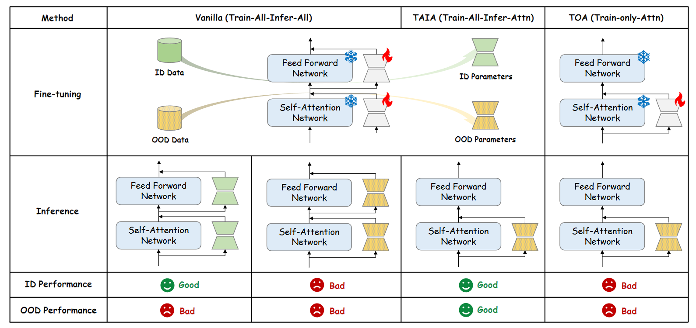
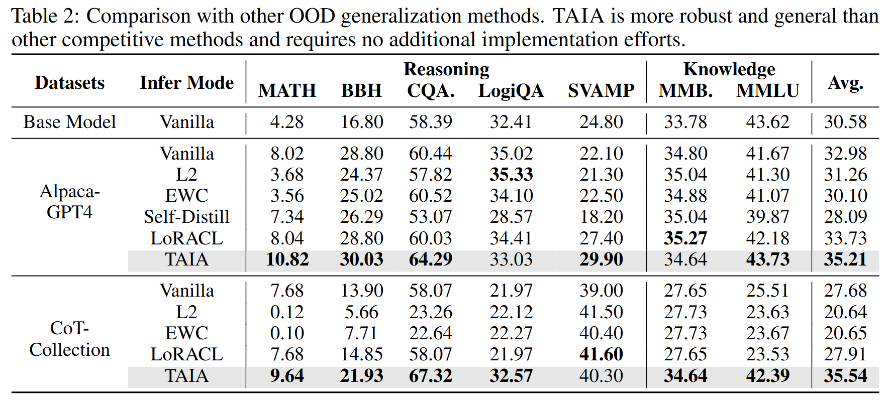
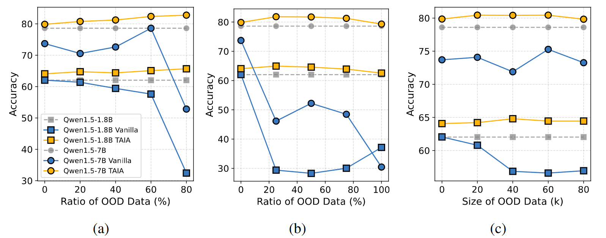
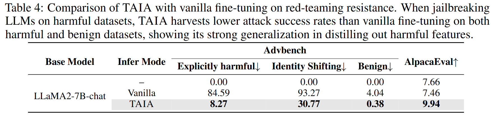
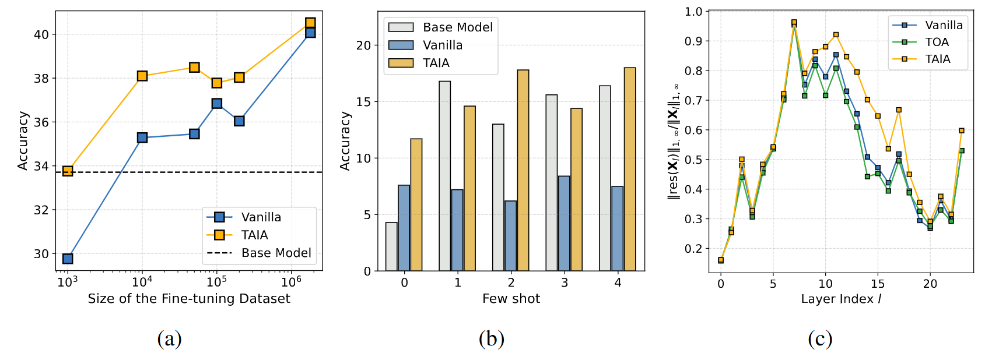

# TAIA: Large Language Models are Out-of-Distribution Data Learners

<p align = "center">

</p>
<p align = "center">
The comparison of TAIA with vanilla fine-tuning method on OOD data.
</p>

## News
🔥 [2024/09/26] Our paper is accepted by NeurIPS 2024 Poster!
* This is the repo for [TAIA: Large Language Models are Out-of-Distribution Data Learners](https://arxiv.org/pdf/2405.20192)


## Contents
- [TAIA: Large Language Models are Out-of-Distribution Data Learners](#taia-large-language-models-are-out-of-distribution-data-learners)
  - [News](#news)
  - [Contents](#contents)
  - [Highlights](#highlights)
  - [Setups](#setups)
    - [Install](#install)
    - [Data Preparation](#data-preparation)
  - [Finetuning](#finetuning)
    - [LoRA Finetuning](#lora-finetuning)
    - [MoLoRA Finetuning](#molora-finetuning)
    - [Safety Finetuning](#safety-finetuning)
  - [Evaluation](#evaluation)
  - [Scaling of TAIA](#scaling-of-taia)
- [Citation](#citation)


## Highlights
* Our proposed **TAIA** as an simple-yet-effective method which can be applied in OOD fine-tuning with large language models. It can avoid the disruption of FFN memories while acquiring superior downstream improvements. 
* **TAIA** can learn OOD features without disturbing internal knowledge. Therefore, it supports vertical task improvement via general fine-tuning data. 
* **TAIA** can learn OOD features without disturbing internal knowledge. Therefore, it resists red-team attacks to a promising extent. 
* Our study achieves superb *data efficiency* (less data with higher performance), *domain generalization* (reservation of few-shot adaptation), and *high representation ability* (higher representation rank). 


## Setups

### Install
1. First clone this repository and nagivate to the TAIA_LLM repository:
```bash
git clone https://github.com/pixas/TAIA_LLM.git
cd TAIA_LLM
```

2. Install Package
   
```bash
conda create -n taia python=3.10
conda activate taia
pip install -e ".[train]"
pip install flash-attn --no-build-isolation
```

### Data Preparation
You can download the `datas.tar.gz` from https://huggingface.co/datasets/pixas/TAIA_data.
Unzip the `datas.tar.gz` and put it as the `datas/` folder.

## Finetuning
We here use `Qwen1.5-1.8B` model as the example backbone. You can change the backbone to any other chat-models and prepare corresponding chat templates.
### LoRA Finetuning
```bash
sbatch scripts/train/slurm/sft_qwen1.5-1.8b-lora.sh
```

**We recommend reproduce TAIA with LoRA tuning, as MoLoRA does not show significant performance gains compared to LoRA, but it introduces substantial training costs and inference latency.**
### MoLoRA Finetuning

```bash
sbatch scripts/train/slurm/sft_qwen1.5-1.8b-molora.sh
```

### Safety Finetuning
For the safety tuning, please first prepare the `llama2_7b_chat` model and check the checkpoint folder and `llama2` folder are specified in the following scripts properly.
For explicitly harmful attack, please run 
```bash
sbatch scripts/train/slurm/sft_llama2-lora-redteam.sh
```
For identity shifting attack, please run 
```bash
sbatch scripts/train/slurm/sft_llama2-lora-aoa.sh
```
For benign attack, please run
```bash
sbatch scripts/train/slurm/sft_llama2-lora-benign.sh
```


## Evaluation
The main evaluation is conducted on seven test sets, covering reasoning, math and knowledge understanding.
All the placeholder of the script **must be** replaced by your own paths. 
For evaluation of TAIA, please first replace the domain in `scripts/eval/slurm/eval_lora_woffn.sh` as the domain you want to test, and run
```bash
bash scripts/eval/slurm/eval_lora_woffn.sh
```
This script will save the evaluation result to `logs/<task>/<checkpoint>.eval.log`.

For the safety evaluation, please run
```bash
bash scripts/eval/slurm/eval_advbench_woffn.sh
```

## Scaling of TAIA
Just replace the data path from `alpaca_gpt4_bilingual` to `mcot_1000`,`mcot_10000`,`mcot_50000`,`mcot_100k`,`mcot_01` and `mcot` and run the `lora` fine-tuning script with the `llama2` backbone.
The data sizes are changed from `[1k, 10k, 50k, 100k, 180k, 2.0m]`, separately.
The evaluation scripts are the same with `bash scripts/eval/slurm/eval_lora_woffn.sh`.

# Citation
If you find TAIA useful for your research and applications, please cite using this BibTeX:

```bibtex
@article{jiang2024taia,
  title={TAIA: Large Language Models are Out-of-Distribution Data Learners},
  author={Jiang, Shuyang and Liao, Yusheng and Zhang, Ya and Wang, Yu and Wang, Yanfeng},
  journal={arXiv preprint arXiv:2405.20192},
  year={2024}
}
```